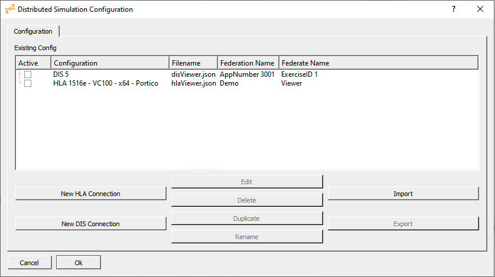

###################
Base Defense System
###################

The "Base Defense System" is a set of three independent, yet interoperable, subsystems, using coreDS Python

You can request a free trial at https://www.ds.tools/contact-us/trial-request/

All subsystems provide support for HLA and DIS.

We assume coreDS Python is already installed and the coreDS Python library is available on the Python Path.

Also, each sample uses a different approach to work with coordinates:
- Aircraft: Uses the coreDS Python built-in lua engine to convert LLA to geocentric coordinates.
- Tank: Uses geocentric coordinates natively.
- Viewer: Relies on pyproj to convert from geocentric to LLA. 

General concepts
################

We use the following naming convention:

    - Input data: from the simulation to this system
    - Output data: from this software to the remote simulation

We are going to define various objects and properties that are going to be showing the coreDS Python UI. The naming conversion used in your code is for your code only, This is what we call the "local naming convention". You will use this naming convention in your code. This approach allows your code to stay "protocol-agnostic" and also "FOM-Agnotic" since you are never bound to a given distributed simulation backend.

The configuration selection window looks like this

  
  coreDS Configuration Selection window

For those who are curious, here is the HLA configuration window

.. figure:: doc/HLA.png
  
  HLA Configuration window

... and the DIS one

  
  DIS configuration window

Based on your local naming convention, you can use the UIs to map your local properties with the remote properties. 

For example, to map incoming properties

  Mapping in

And mapping outgoing properties

  
  Mapping out

******
Viewer
******

Once the Viewer is running, head to http://127.0.0.1:5000/ in your browser to see the map displayed

.. figure:: doc/Viewer.png
  
  Map showing remote entities

The Viewer sample provides a map that displays all remote entities. 

  
  A Similar view from coreDS X-Plane shows the same entities from this sample.

Imports
=======

This sample requires flask, folium, pyproj. These two packages will be automatically installed if they are not already available.

Exposing properties to the coreDS Python UIs
============================================

First, we have to register the local object / local messages and properties known by this program
    
    - Input data: from the simulation to this system
    - Output data: from this software to the remote simulation

In the following code snippet, we are going to define various objects and properties that are going to be showing the coreDS Python UI. The naming conversion used in your code is for your code only, This is what we call the "local naming convention". You will use this naming convention in your code. This approach allows your code to stay "protocol-agnostic" and also "FOM-Agnotic" since you are never bound to a given distributed simulation backend.

.. code-block:: python

    MessageIn = coreDSPython.cCoreDSMapping()
    MessageIn.add("Explosion", "X")
    MessageIn.add("Explosion", "Y")
    MessageIn.add("Explosion", "Z")

    ObjectIn = coreDSPython.cCoreDSMapping()
    ObjectIn.add("Airplane", "X")
    ObjectIn.add("Airplane", "Y")
    ObjectIn.add("Airplane", "Z")
    ObjectIn.add("Airplane", "Name")

    ObjectIn.add("Tank", "X")
    ObjectIn.add("Tank", "Y")
    ObjectIn.add("Tank", "Z")
    ObjectIn.add("Tank", "Name")

    ObjectIn.add("MissileObject", "X")
    ObjectIn.add("MissileObject", "Y")
    ObjectIn.add("MissileObject", "Z")
    ObjectIn.add("MissileObject", "Name")

The relation between the local naming convention and the remote naming conversion is done through the coreDS configuration UI.

We can show the coreDS Python UI using the "showConfigHelper" function.

.. code-block:: python

    #We show the configuration UI
    coreDSInstance.showConfigHelper(ioconfig, ObjectIn, coreDSPython.cCoreDSMapping(), MessageIn, coreDSPython.cCoreDSMapping())

We can now register our Handlers (callbacks) functions that can process the information received from coreDS Python.

coreDS Python supports 2 different handlers mechanisms: callback objects or callback functions. Then again, handler registration must be done using the local naming convention.

For example, to call a function every time a "Tank" is updated, you would use the following code.

.. code-block:: python

    coreDSInstance.registerObjectUpdateHandler("Tank", incomingObjManagerObj)

In our viewer, we are using an object callback defined like this:

.. code-block:: python

    class ObjectUpdateManager(coreDSPython.CallbackObjectUpdateHandler):
        def __init__(self):
            super(ObjectUpdateManager, self).__init__()
            self.objectList = {}
            self.ground = 0
            
        def run(self, localUniqueObjectIdentifier, objectType, values):
            ## Add the latest values to the discovered aircraft list
            with lock:
                try:                    
                    self.objectList[localUniqueObjectIdentifier] = {}
                
                    self.objectList[localUniqueObjectIdentifier]['name'] = objectType

                    # The Aircraft sample uses a provided Lua script to convert from LLA to geocentric.
                    # Let's use pyproj to convert from geocentric to LLA

                    transformer = pyproj.Transformer.from_crs(
                        {"proj":'geocent', "ellps":'WGS84', "datum":'WGS84'},
                        {"proj":'latlong', "ellps":'WGS84', "datum":'WGS84'},
                        )

                    lon, lat, alt = transformer.transform(values['X'].toDouble(),values['Y'].toDouble(),values['Z'].toDouble(),radians=False)

                    self.objectList[localUniqueObjectIdentifier]['value'] = coreDSPython.CVariant(values) #copy values

                    ## Add the LLA information into our CVariant so we can use it later
                    self.objectList[localUniqueObjectIdentifier]['value']['lat'] = lat
                    self.objectList[localUniqueObjectIdentifier]['value']['lon'] = lon
                    self.objectList[localUniqueObjectIdentifier]['value']['alt'] = alt

                    print("Received " , objectType, values['Name'], "at location received at location ", self.objectList[localUniqueObjectIdentifier]['value'])

                except Exception as e:
                    logging.error(f'{e}. Continuing execution...')

Let's focus on this line: 

.. code-block:: python

    lon, lat, alt = transformer.transform(values['X'].toDouble(),values['Y'].toDouble(),values['Z'].toDouble(),radians=False)

That line processes the information received from the distributed simulation backend. Using your local naming convention, you can extract the required values. The rest of this handler is boiler plate code to store the data to be used by the map engine.

We also want to know when a remote object is being removed from the simulation. The ObjectRemoveHandler is what you need:

.. code-block:: python

    coreDSInstance.registerObjectRemovedHandler("MissileObject", objectRemoved)

where the objectRemoved function is defined like this:

.. code-block:: python

    def objectRemoved(objIdentifier):
        with lock:
            try:
                incomingObjManagerObj.objectList.pop(objIdentifier) 
                print("Removing object id: ", objIdentifier) 
            except:
                pass     

When everything is configured, we can call the initAndConnect function to start the connection to the distributed simulation backend.

.. code-block:: python

    coreDSInstance.initAndConnect(ioconfig) 

Voilà!

Aircraft
--------

This sample creates "n" flying objects moving in concentric circles on top of Quebec City, Quebec, Canada
Units are lat/long/alt and are converted to geocentric using coreDS builtin Lua scripts

Let's focus on the most important part of this sample: updating objects.

.. code-block:: python

    outputvals = coreDSPython.CVariant()
    outputvals["FlyingObjectX"] = pts[number][i%len(pts[number])][1]
    outputvals["FlyingObjectY"] = pts[number][i%len(pts[number])][0]
    outputvals["FlyingObjectZ"] = elevation
    outputvals["Name"] = "PythonAir" + str(number)

    #Send the object data back to the simulation network (either DIS or HLA, depending on the configuration)
    coreDSInstance.updateObject("MyLocalInstance" + str(number), "FlyingObject", outputvals)
    
The first step is to instantiate a CVariant object. A CVariant object is a generic container that can contain any datatype. The object can now be filled with the properties that need to be updated.

During the configuration phase, we've mapped FlyingObjectX, FlyingObjectY and FlyingObjectZ to the corresponding WorldLocation.X/Y/Z, and name to Marking.

Calling the "updateObject" sends the object update to the distributed simulation network.

This sample relies on Lua to convert from LLA to geocentric coordinates. Let's review the mapping UI again

  
  Mapping out

Notice the "ConvertLocationToHLA.lua" next to the "On Data Updated" line. This lua script will convert to coordinates to the correct format. This can be an interesting feature if you need to change the input/output values on the fly but don't want to change the underlying Python code.

MissileLauncher
---------------

In the previous samples, we've learned how to send and receive objects. The only new concept introduced in the MissileLauncher sample is sending a message (Interaction).

.. code-block:: python

    outputvals = coreDSPython.CVariant()
    outputvals["ExplosionX"] = currentMissileX
    outputvals["ExplosionX"] = currentMissileY
    outputvals["ExplosionX"] = currentMissileZ
    coreDSInstance.sendMessage("Explosion", outputvals)

The concept is very close to updating an object. We create and fill a CVariant then call sendMessage.